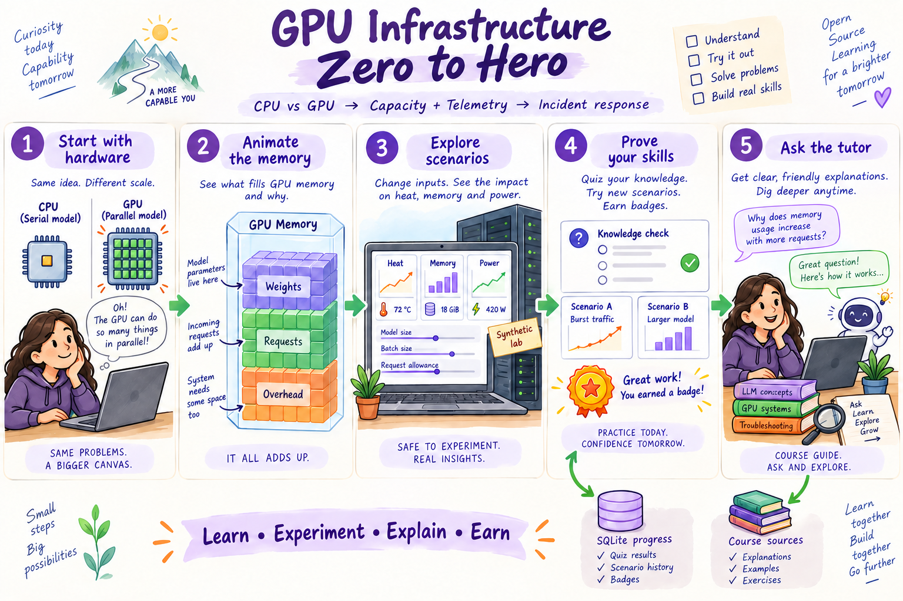
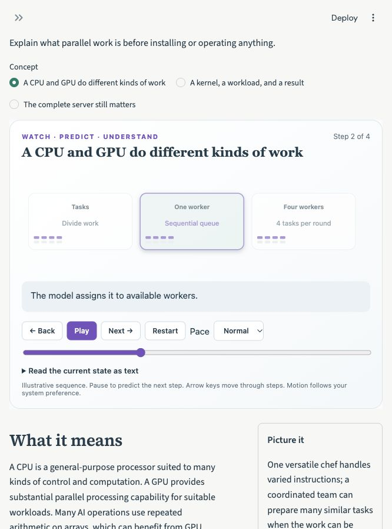
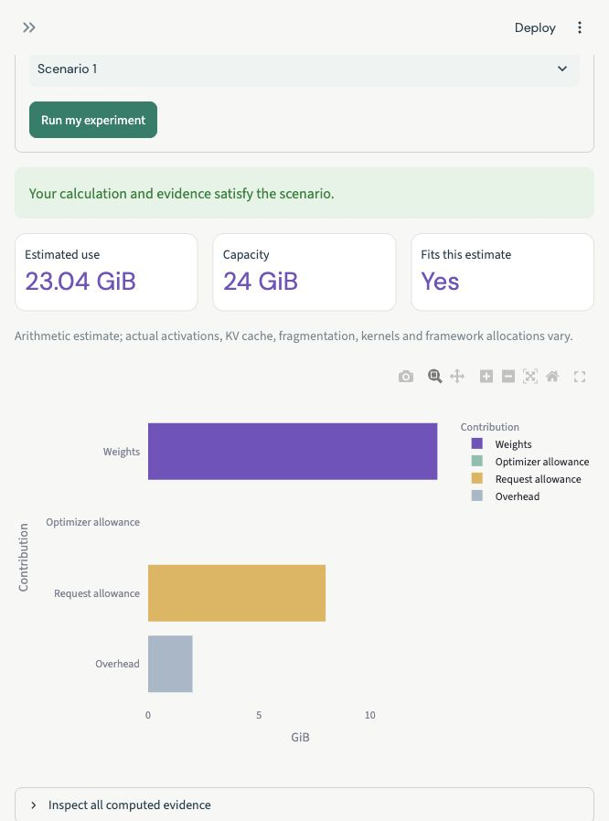
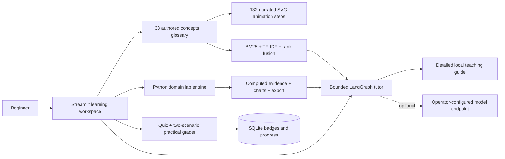

# GPU Infrastructure Zero to Hero

[](https://github.com/sivalinb/gpu-infrastructure-zero-to-hero/actions/workflows/ci.yml)


Start with CPU and GPU work, kernels, host RAM and VRAM, bytes and GiB. Then reason about weights, inference, batching, training state, DCGM telemetry, utilization, power, cooling, XID and ECC evidence, distributed placement, Kubernetes GPU requests, and PromQL semantics.

**No prerequisite infrastructure expertise, API key, or GPU purchase is needed to start.** This Python + Streamlit course has 11 levels (0–10), 33 guided concepts, 132 narrated animation steps, 33 practice checks, 55 quiz questions, 11 practical labs, and 11 badges.



*Illustrated teaching overview. The implemented lab boundaries and exact runtime behavior are described below; the drawing is not a screenshot or a hardware capability guarantee.*

## Start in one command

Install Python 3.11, 3.12, or 3.13, then:

```bash
git clone https://github.com/sivalinb/gpu-infrastructure-zero-to-hero.git
cd gpu-infrastructure-zero-to-hero
python3 scripts/bootstrap.py
```

On Windows, use `python` where your installation provides it. The bootstrap creates `.venv`, installs pinned dependencies, and opens a loopback Streamlit server. Visit **[http://127.0.0.1:8523](http://127.0.0.1:8523)**. Stop it with Ctrl+C. First installation needs Internet access to download packages; ordinary lessons and default experiments then run locally.

For an existing environment:

```bash
python -m pip install -r requirements.txt
python -m streamlit run app.py --server.address=127.0.0.1 --server.port=8523
```

## How learning works

1. **Learn:** choose a concept; predict the next frame, then use Play, Pause, Back, Next, speed, or the step slider. Every frame changes the illustrated state and explains what changed. An accessible text view describes the same state.
2. **Understand:** read the plain-language explanation, analogy, worked example, misconception, and glossary. Practice questions explain both correct and incorrect answers.
3. **Experiment:** run a plan, inspect actual computed evidence, and change the scenario. Hints are available without awarding a badge.
4. **Prove it:** score at least 80% on five questions **and** pass your practical plan on both scenario variants. Grading runs in Python; quiz answers or a client-supplied success flag cannot replace the practical check.
5. **Keep progressing:** each completed level earns 100 XP and a badge, then unlocks the next assessment. All lessons remain available to preview. Download your private resume code to reconnect to your locally stored SQLite profile.
6. **Ask:** the tutor retrieves detailed course material with sources. Select a topic before asking “explain this.” Optional model configuration enables conversational generation.




## Level 0 → Level 10

| Level | Topic | What you will learn to do | Badge |
|---|---|---|---|
| 00 | Meet the CPU and GPU | Explain what parallel work is before installing or operating anything. | Parallel Explorer |
| 01 | VRAM, model weights, and precision | Calculate a weight footprint using explicit units and assumptions. | Memory Calculator |
| 02 | Why a model can still run out of memory | Include request state, batching, overhead, and training-specific allocations. | Capacity Planner |
| 03 | Read GPU telemetry | Preserve metric meaning, units, availability, and observation time. | GPU Observer |
| 04 | Utilization, throughput, and latency | Distinguish busy hardware from useful application results. | Workload Analyst |
| 05 | Power, heat, and clock changes | Interpret a thermal pattern using related readings and actual equipment limits. | Thermal Investigator |
| 06 | GPU errors and evidence preservation | Distinguish an error code, an error count, and an appropriate investigation. | Evidence Keeper |
| 07 | Multiple GPUs and communication | Separate replication, sharding, memory placement, and interconnect constraints. | Placement Planner |
| 08 | GPU scheduling and isolation | Read a whole-GPU Pod request and reason about capacity and pending jobs. | GPU Scheduler |
| 09 | Prometheus metrics and trustworthy alerts | Interpret exported fields correctly and connect them to your query skills. | Alert Designer |
| 10 | An AI-infrastructure incident | Choose a response for memory pressure versus thermal pressure and verify the modeled outcome. | AI Infrastructure Investigator |

## What actually executes

A transparent capacity calculator shows every memory assumption. Synthetic telemetry replays demonstrate memory pressure, heat and falling clock speed, input starvation, and error codes. A bounded whole-GPU scheduler checks Pod resource declarations. The optional nvidia-smi script only reads existing compatible hardware.



The original curriculum lives in `content/course.json`. Official links support further reading; the application does not fetch third-party pages or treat them as instructions. Models have no grading, shell, or equipment-control tool.

## Runnable examples

Activate the environment created by the bootstrap (`source .venv/bin/activate` on macOS/Linux; `.venv\Scripts\Activate.ps1` in Windows PowerShell), then run:

```bash
python -m academy.server --mode gpu --port 8633 --scenario thermal
# Optional, on an existing compatible NVIDIA machine:
python -m scripts.live_gpu
```

The examples are explained in [the hands-on guide](docs/HANDS_ON.md). Their output should be used to justify an explanation, not only to collect a green check.

## Optional Docker stack

With Docker and Compose installed:

```bash
docker compose up --build -d
# Stop containers without deleting the saved progress volume:
docker compose down
```

The app remains at port 8523. All published host ports bind to `127.0.0.1`. Compose adds a synthetic HTTP training target and an official Prometheus server.
See `compose.yaml` and [the hands-on guide](docs/HANDS_ON.md) for the protocol verification command. This is a local teaching stack; hosted deployments need their own identity, storage, and operational design. Streamlit Cloud can run `app.py`, but local SQLite progress may not survive a recreated host.

## AI course techniques

| Week | Technique | Where it is applied |
|---|---|---|
| 1 | AI-assisted Python app development and visual data exploration | Streamlit, Plotly, evidence tables, interactive SVG sequences |
| 2 | Retrieval and cited answers | Concept-sized chunks, BM25 plus sparse TF-IDF vectors, reciprocal rank fusion, top-three context, source links, unknown-topic response |
| 3 | Stateful agent workflow | LangGraph route → retrieve → inspect → explain → cite; bounded execution and lab-evidence inspection |
| 4 | Evaluation | Versioned 31-case tutor regression set, real protocol tests, practical transfer cases, Streamlit interaction tests, CI |
| 5 | Synthetic data, LoRA, merge, baseline comparison | [Optional question-router workflow](training/README.md), seed-family split, training configs, notebook, measured model evaluator, validated runtime hook |
| 6 | Security and guardrails | No model authority over scores or equipment; input budgets, safe parsers, least-privilege simulation, local endpoints, secret-field scrubbing, profile ownership checks |

TF-IDF is a sparse lexical representation, not a dense semantic embedding model. Default tutor mode is a detailed **authored teaching guide**, not a generative model. Optional LoRA training has not been executed on this development machine; no trained adapter or model-quality gain is claimed.

## Optional conversational tutor

Use an existing operator-managed [Ollama](https://docs.ollama.com/api/chat) model server, then set:

```bash
TUTOR_OLLAMA_URL=http://127.0.0.1:11434 TUTOR_MODEL=YOUR_INSTALLED_MODEL python -m streamlit run app.py --server.address=127.0.0.1 --server.port=8523
```

The app sends the question, retrieved course context, and bounded redacted lab evidence to that configured endpoint. HTTP is limited to loopback or the documented container hostname; remote endpoints require HTTPS. If the model is unavailable, the authored guide remains usable. Generated explanations still require scrutiny; citation presence alone does not prove faithfulness.

## Validation and the beginner review

```bash
python -m pip install -r requirements-dev.txt
ruff check .
pytest -q
python -m scripts.evaluate_tutor --check
python -m training.prepare
```

[Measured tutor results](docs/tutor-evaluation.json), [validation evidence](docs/VALIDATION.md), and [the fresh-graduate persona review](docs/GRADUATE_REVIEW.md) make the limits reviewable. The reviewer checks whether each skill can be explained and transferred rather than treating badges as expertise. Try the [independent capstone](docs/INDEPENDENT_CAPSTONE.md) without copying a worked plan.

**Scope:** Default labs do not execute CUDA kernels, DCGM diagnostics, native collectives, or Kubernetes scheduling. Arithmetic estimates are not universal memory formulas or OOM guarantees. Telemetry is synthetic; the HTTP exporter exposes the final replay sample, so it is suitable for scrape and semantic exercises, not a live workload rate benchmark. The Pod example declares resources but does not run a GPU kernel. MIG and sharing are taught rather than provisioned.

**Next supervised practice:** Run a supported workload on a real GPU. Confirm the kernel execution path and output, measure actual memory and latency, inspect supported DCGM fields and collection health, and try a real device-plugin-backed Kubernetes workload. Validate distributed partitions, interconnects, and framework behavior before making placement or performance claims.

## Sources and related courses

- [NVIDIA DCGM learning and reference](https://docs.nvidia.com/datacenter/dcgm/latest/)
- [DCGM Exporter metrics and availability](https://docs.nvidia.com/datacenter/dcgm/latest/reference/dcgm-exporter-metrics.html)
- [Kubernetes GPU scheduling](https://kubernetes.io/docs/tasks/manage-gpus/scheduling-gpus/)
- [NVIDIA MIG guide](https://docs.nvidia.com/datacenter/tesla/mig-user-guide/latest/index.html)

Continue across the infrastructure learning path: [SPL](https://github.com/sivalinb/spl-zero-to-hero), [PromQL](https://github.com/sivalinb/promql-zero-to-hero), [Redfish + IPMI](https://github.com/sivalinb/redfish-zero-to-hero), [OpenTelemetry](https://github.com/sivalinb/opentelemetry-zero-to-hero), and [GPU infrastructure](https://github.com/sivalinb/gpu-infrastructure-zero-to-hero).

Illustration generation prompts are preserved in `docs/assets/architecture-prompt.txt` and `architecture-revision-prompt.txt`. Original lesson prose and code are MIT licensed; linked specifications and product documentation retain their own terms.
